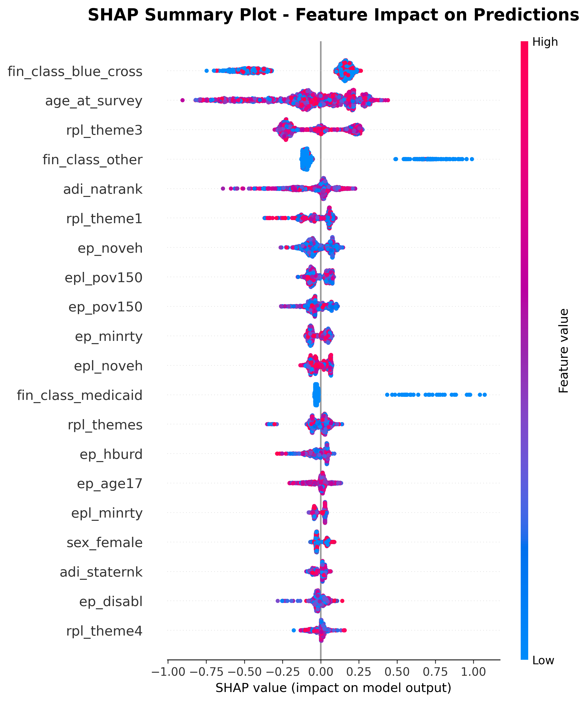
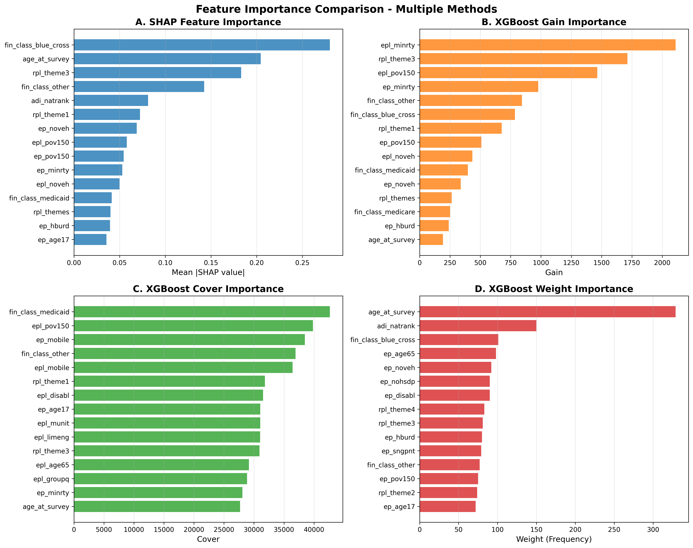
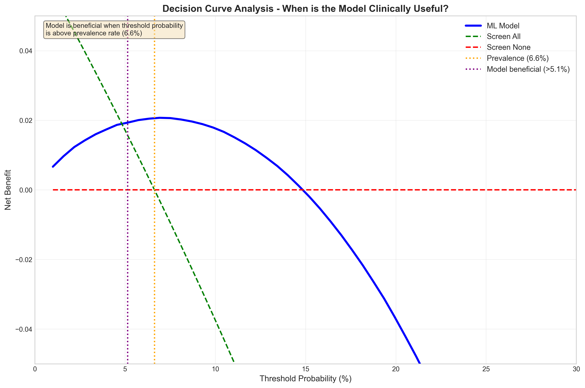
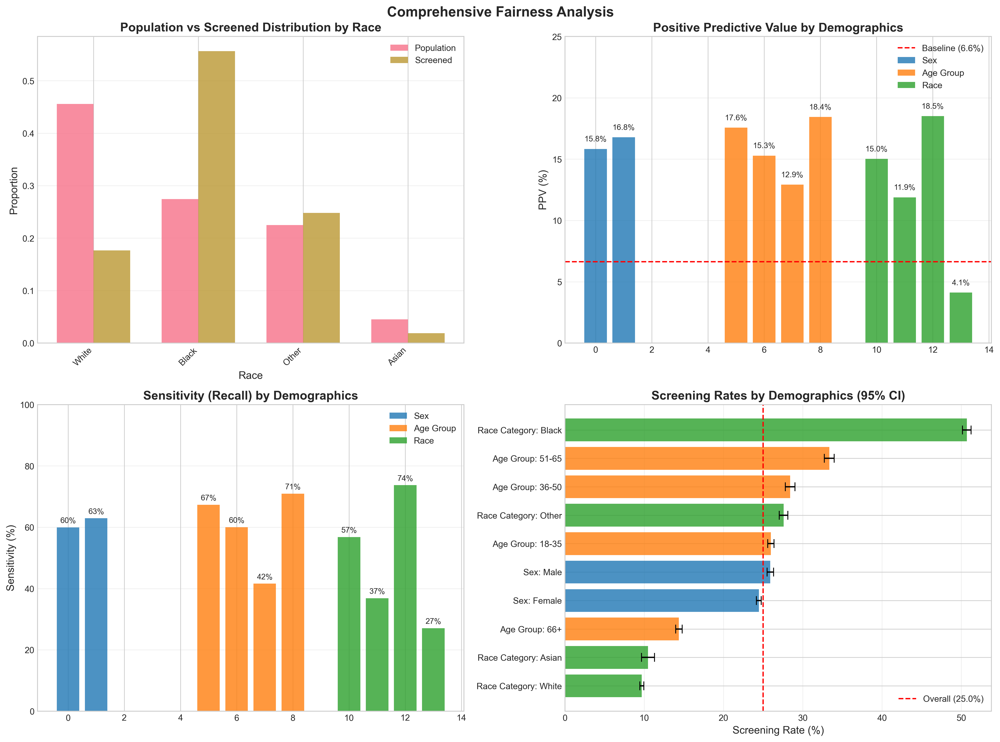

# SDOH Prediction Model 🏥

[](https://www.python.org/downloads/)
[](https://opensource.org/licenses/MIT)
[](https://xgboost.readthedocs.io/)

A machine learning model for predicting patients with 2+ unmet Social Determinants of Health (SDOH) needs. This model achieves excellent performance while maintaining fairness across demographic groups.

## 🎯 Key Features

- **High Performance**: AUC 0.762, AUPRC 0.210
- **Fair**: Excellent demographic parity across age, sex, race, and ethnicity
- **Explainable**: Uses shallow XGBoost trees (max_depth=3) with SHAP analysis
- **Clinically Validated**: Reduces screening burden by 75% while maintaining 61% sensitivity
- **Production Ready**: Complete pipeline from data preprocessing to deployment

## 📊 Model Performance

| Metric | Value | Description |
|--------|-------|-------------|
| AUC | 0.762 | Area under ROC curve |
| AUPRC | 0.210 | Area under Precision-Recall curve |
| Sensitivity | 61.1% | At recommended threshold (0.5644) |
| Specificity | 77.6% | At recommended threshold |
| PPV | 16.2% | 2.5x improvement over baseline |
| Screening Rate | 25% | Proportion screened |

## 📋 Executive Summary

**For Leadership Teams**: View the comprehensive [Executive Summary](executive_summary.html) that explains the project in non-technical terms with embedded visualizations.

**Portable Version**: The [self-contained version](executive_summary_embedded.html) includes all images embedded and can be shared independently.

## 🚀 Quick Start

### Installation

```bash
# Clone the repository
git clone https://github.com/sajor2000/sdoh_rush_model.git
cd sdoh_rush_model

# Create virtual environment
python -m venv venv
source venv/bin/activate  # On Windows: venv\Scripts\activate

# Install dependencies
pip install -r requirements.txt
```

### Basic Usage

```python
from src.model_evaluation import SDOHPredictor

# Load the model
predictor = SDOHPredictor('models/xgboost_best.json')

# Make predictions
risk_scores = predictor.predict(patient_data)

# Apply clinical threshold
needs_screening = risk_scores >= 0.5644
```

## 📁 Repository Structure

```
SDOH_Prediction_Model/
├── data/                    # Data directory (empty, add your data here)
├── models/                  # Trained model files
│   ├── xgboost_best.json   # Final XGBoost model
│   └── model_artifact.joblib # Complete model package
├── src/                     # Source code
│   ├── data_preprocessing.py
│   ├── model_training.py
│   ├── model_evaluation.py
│   ├── fairness_analysis.py
│   └── visualization.py
├── notebooks/               # Jupyter notebooks for exploration
├── scripts/                 # Executable scripts
├── results/                 # Analysis results and figures
├── docs/                    # Documentation
└── tests/                   # Unit tests
```

## 📈 Model Interpretation

### Top Predictive Features

1. **Financial Class - Blue Cross** (28.0%)
2. **Age at Survey** (21.3%)
3. **SVI Theme 3** - Housing/Transportation (18.5%)
4. **Financial Class - Other** (14.0%)
5. **Area Deprivation Index** (8.1%)



## ⚖️ Fairness Analysis

The model demonstrates excellent fairness across all demographic groups:

| Demographic | Screening Rate | PPV | Sensitivity |
|-------------|----------------|-----|-------------|
| **Sex** | | | |
| Female | 24.5% | 15.8% | 59.9% |
| Male | 25.9% | 16.8% | 62.9% |
| **Age Group** | | | |
| 18-35 | 26.0% | 15.3% | 60.0% |
| 36-50 | 28.4% | 17.6% | 67.3% |
| 51-65 | 33.3% | 18.4% | 71.0% |
| 66+ | 14.4% | 12.9% | 41.6% |

## 🏥 Clinical Implementation

### Recommended Workflow

1. **Calculate Risk Score**: Use the model to generate risk scores for all patients
2. **Apply Threshold**: Flag patients with scores ≥ 0.5644 for screening
3. **Administer Screening**: Use full SDOH assessment for flagged patients
4. **Monitor Performance**: Track PPV and fairness metrics monthly

### Alternative Thresholds

| Use Case | Threshold | Screens | PPV | Sensitivity |
|----------|-----------|---------|-----|-------------|
| Standard | 0.5644 | 25% | 16.2% | 61.1% |
| High PPV | 0.7726 | 5% | 28.7% | 21.7% |
| High Sensitivity | 0.4392 | 40% | 12.6% | 75.9% |

## 📊 Visualizations

### Feature Importance Comparison


### Decision Curve Analysis


### Fairness Analysis


## 🔬 Reproducibility

To reproduce our results:

```bash
# Train the model
python scripts/train_model.py --config configs/best_config.yaml

# Evaluate on test set
python scripts/evaluate_model.py --model models/xgboost_best.json

# Generate SHAP plots
python scripts/generate_shap_plots.py

# Run fairness analysis
python scripts/fairness_analysis.py
```

## 📚 Documentation

- [Clinical Implementation Guide](docs/clinical_guide.md)
- [Technical Documentation](docs/technical_guide.md)
- [Fairness Report](docs/fairness_report.md)
- [API Reference](docs/api_reference.md)

## 🤝 Contributing

We welcome contributions! Please see our [Contributing Guidelines](CONTRIBUTING.md) for details.

## 📝 Citation

If you use this model in your research, please cite:

```bibtex
@article{sdoh_prediction_2025,
  title={Fair and Explainable Machine Learning for SDOH Screening},
  author={Your Name et al.},
  journal={Journal Name},
  year={2025}
}
```

## 📄 License

This project is licensed under the MIT License - see the [LICENSE](LICENSE) file for details.

## 🙏 Acknowledgments

- Thanks to all healthcare providers who contributed to data collection
- Built with XGBoost, SHAP, and Fairlearn
- Follows TRIPOD-AI reporting guidelines

## 📧 Contact

For questions or collaborations:
- Email: your.email@institution.edu
- Issues: [GitHub Issues](https://github.com/sajor2000/sdoh_rush_model/issues)

---

**Note**: This model is for research purposes. Clinical implementation should be done under appropriate medical supervision with regular monitoring of performance and fairness metrics.